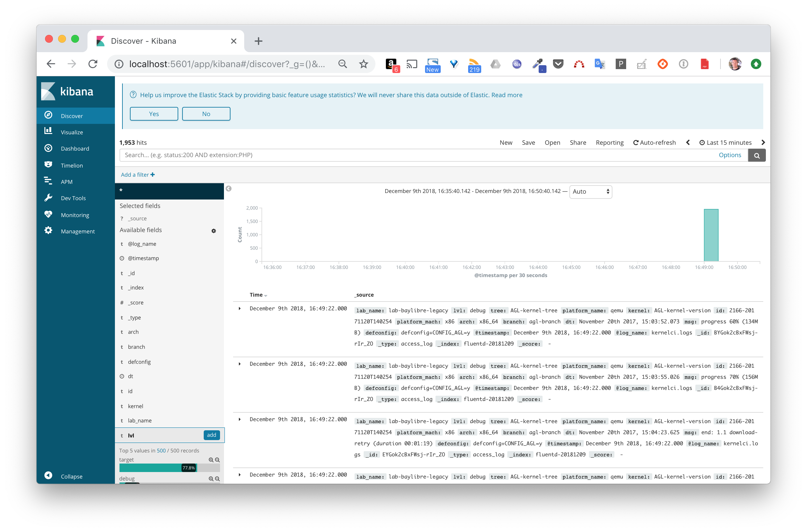

In order to simplify the search in log files, an EFK stack (Elasticsearch, Fluentd, Kibana) can be used.
Log files are indexed in Elasticsearch, as soon as they are created on the filesystem, and filtered through Kibana great interface. 

*** WIP ***

## The search application

The search application is defined in the `docker-compose.yml` file. It basically defines the 3 services of the stack:

- fluentd: specifies the log files to take into account (different paths for boot and build logs)

- elasticsearch: index each line of the logs it receives 

- kibana: provides a fancy interface to search within the logs

## How it works

In this first version fluentd is configured to check the new log files written to disk and parses them accordingly.

All the files with *.log* extension located in the *$PWD/log* folder are taken into account.

Note: this location is only used for the POC, the correct one needs to the decided afterwards

Kibana can then be used to search the logs in a very clean way. It's a very configurable tool which provides a lot of filters and visualisation tools.

## Running the stack

The following command needs to be run from the _search_ folder in order to launch the stack, that's it.

```
docker-compose up -d
```

The stack is expecting log file in the _search/log_ folder (specified by _$PWD/log_ in the docker-compose.yml file)

Note: the stack might take a couple of seconds before it's up and running

## Files ingestion

Now that the stack is running, we need to provide some log files so they can be indexed and searched.

A parser script is available through the image lucj/kernelci-log:1.2. This parser requires 2 bind mounts in order to run:
- the input directory where it needs to get the raw json file
- the ouput directory where it needs to create the result files (the ones ready to be sent to an Elastic stack)

By default, the parser will check if new files are available in the input folder every 10 seconds (but this can be changed dynamically).

The following command needs to be used in order to run this parser:

```
$ docker container run -v INPUT_FOLDER:/in -v OUTPUT_FOLDER:/out lucj/kernelci-log:1.2
```

For instance, let's say we want to read from the */tmp/in* folder and to write the results in the */tmp/out* folder (both folder would need to be created first), the command would be

```
$ docker container run -v /tmp/in:/in -v /tmp/out:/out lucj/kernelci-log:1.2
INFO:Started
INFO:20171210T205402 - 0 files to process in /in
INFO:20171210T205412 - 0 files to process in /in
...
```

In the _search/log_ folder, 2 files are present by default: _raw-sample-1.json_ and _raw-sample-1.json_.
Those files are exemples generated by Lava, they contain raw data and need to be processed before they can be sent to Elastic.

If we copy those 2 files in the /tmp/in folder, they will be processed by the parser as we can see in it logs

```
...
INFO:20171210T205522 - 2 files to process in /in
INFO:-> processing file /in/raw-sample-1.json
INFO:=> log file /out/raw-sample-1.json-20171210T205522.log generated
INFO:-> processing file /in/raw-sample-2.json
INFO:=> log file /out/raw-sample-2.json-20171210T205524.log generated
...
```

For each raw file, a new file has been created and is ready to be used by the EFK stack. If the output folder of the parser is the same as the input folder specified for the EFK stack then each file created will first be ingested by fluentd and indexed in elasticsearch. Each record will look like the following.

```
{
  "lvl" => "results",
  "kernel" => "AGL-kernel-version",
  "tree" => "AGL-kernel-tree",
  "defconfig" => "defconfig+CONFIG_AGL=y",
  "branch" => "agl-branch",
  "dt" => "2017-11-20T14:05:43.785168",
  "result" => "pass",
  "path" => "/kernelci/log/log-20171124T124620.log",
  "@timestamp" => 2017-11-24T12:46:30.441Z,
  "@version" => "1",
  "host" => "1a4412211f21",
  "definition" => "lava",
  "arch" => "x86_64",
  "case" => "job
}
```

It's then very easy to search / filter logs through Kibana and to produce nice dashboards.

The Kibana interface is available on [http://localhost:5601/](http://localhost:5601/)



To index some other files, you need to copy the raw version in the _search/log_ folder and run the previous container on each of them.

## Status

This is a WIP dedicated to enhance the search within the log files.
Any feedback is welcome.

## Additional note

This stack does not need to have the whole application deployed as a Docker Compose application. It could be tested on a existing dev/test instance of kernelci.
